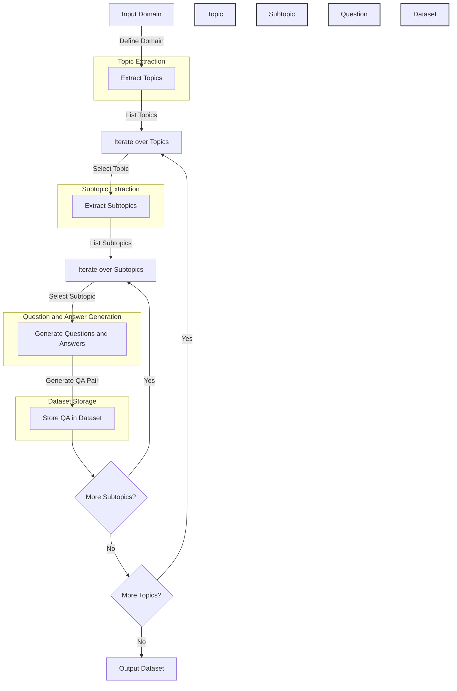

# GeneratorPromptKit
### A Python Library and Framework for Automated Generator Prompting and Dataset Generation

This is a Python library and framework for automated generator prompting and dataset generation using large language models (LLMs). Inspired by the work of Chen et al. in their paper "GenQA: Generating Millions of Instructions from a Handful of Prompts", this library provides a structured approach to creating diverse and high-quality datasets using a combination of generator prompts, topic extraction, and subtopic exploration.

## Overview

The key idea behind GeneratorPromptKit is to leverage the power of LLMs to generate diverse and relevant questions and answers based on a given input domain. By iteratively extracting topics and subtopics from the domain and using carefully crafted generator prompts, the library enables the creation of large-scale datasets with minimal human intervention.

### Demo Generation Example

| topic                 | subtopic            | question                                                                                    | answer                                                                                   |
|-----------------------|---------------------|---------------------------------------------------------------------------------------------|------------------------------------------------------------------------------------------|
| Internet of Things    | IoT Data Analytics  | How can leveraging insights from connected devices revolutionize decision-making processes in various industries?| By harnessing the power of IoT data analytics, organizations can gain real-time insights...|
| Data Structures and Algorithms | Sorting Algorithms | How can the efficiency of sorting algorithms be further improved beyond traditional comparisons and swaps?     | One innovative approach to enhancing the efficiency of sorting algorithms beyond...       |
| Operating Systems     | Memory Management   | How does efficient memory management contribute to the overall performance of an operating system?| Efficient memory management plays a crucial role in optimizing the performance of an...    |
| Computer Networks     | Network Security    | How can we ensure the confidentiality and integrity of data transmitted over a network, especially in the presence of potential threats?  | To safeguard data during transmission, network security mechanisms like encryption,...    |
| Operating Systems     | Memory Management   | How does the efficient utilization of resources contribute to the overall performance of a system?    | Efficient memory management plays a crucial role in optimizing system performance by...    |


### Flowchart



## Features

- **Automated Topic and Subtopic Extraction**: GeneratorPromptKit automatically extracts topics and subtopics from the input domain using LLMs, enabling efficient exploration of the domain space.
- **Generator Prompts**: The library provides a set of carefully designed generator prompts that encourage diversity, creativity, and relevance in the generated questions and answers.
- **Customizable Prompts**: Users can easily modify and extend the existing prompts or add their own prompts to suit their specific requirements.
- **Randomness and Diversity**: GeneratorPromptKit incorporates randomness boosters and indirect question generators to enhance the diversity of the generated dataset.
- **Integration with OpenAI API**: The library seamlessly integrates with the OpenAI API, allowing users to leverage their language models for dataset generation.

## Installation

To install GeneratorPromptKit, simply use pip:

```bash
pip install generator-prompt-kit
```

## Usage

Here's a basic example of how to use GeneratorPromptKit to generate a dataset:

```python
from GeneratorPromptKit import GeneratorPromptKit
import pandas as pd

# Initialize the GeneratorPromptKit
gpk = GeneratorPromptKit(api_key='your_openai_api_key')

# Set the input domain
input_domain = "Computer Science"

# Generate the dataset
dataset = gpk.generate_dataset(input_domain, num_topics=10, num_subtopics=5, num_datapoints=100)

# Save the dataset to a file
dataset.save('computer_science_dataset.csv')

# Printing what has been generated
df = pd.read_csv('computer_science_dataset.csv')
print(df)
```

## Performance

For detailed benchmarks and experimental results, please refer to the original paper "GenQA: Generating Millions of Instructions from a Handful of Prompts" by Chen et al. GeneratorPromptKit was created as an inspiration from their work and aims to provide a practical implementation of the concepts and techniques discussed in the paper.

## Cite our Work

```
@inproceedings{generator-prompt-kit,
  title = {GeneratorPromptKit: A Python Library for Automated Generator Prompting and Dataset Generation},
  author = {Aman Priyanshu, Supriti Vijay},
  year = {2024},
  publisher = {{GitHub}},
  url = {https://github.com/AmanPriyanshu/GeneratorPromptKit}
}

```

## References

- Chen et al. "GenQA: Generating Millions of Instructions from a Handful of Prompts". arXiv preprint arXiv:2406.10323, 2024.

## Contributing

Contributions to GeneratorPromptKit are welcome! If you encounter any issues, have suggestions for improvements, or want to add new features, please open an issue or submit a pull request on the [GitHub repository](https://github.com/AmanPriyanshu/GeneratorPromptKit)

## License

GeneratorPromptKit is released under the [MIT License](/LICENSE).
